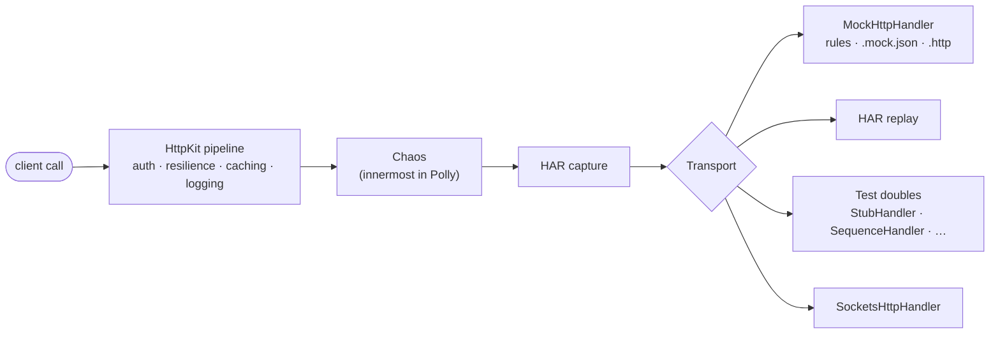

# AwadyLab.HttpKit.Testing

Testing support for [AwadyLab.HttpKit](https://www.nuget.org/packages/AwadyLab.HttpKit): mocks, fixtures, HAR
capture and replay, chaos injection and test doubles.


---

## Overview

The package replaces a client's **transport** without touching the rest of its pipeline, so a test still
exercises the real serialization, authentication, resilience, caching and logging — only the network is
gone.



### Key Highlights

* **Strict Mocks**: an unmatched request fails with the request *and* every configured rule in the message,
  instead of a confusing failure somewhere else.
* **Fixtures You Already Have**: `.mock.json` files, and the `.http` files editors and REST clients use.
* **Safe Recordings**: HAR capture redacts sensitive headers at capture time, so a recording can be committed.
* **Repeatable Chaos**: Simmy faults, latency and outcomes with a fixed seed, injected where the client's own
  retry and breaker react to them.
* **No Sleeping**: delays run on `TimeProvider`, so tests advance a fake clock.

---

## Installation

```bash
dotnet add package AwadyLab.HttpKit.Testing
```

---

## Quickstart

Per-client testing settings are read **while the client is registered**, so they go in the `AddHttpKit`
callback. `AddHttpKitTesting()` then switches the hooks on:

```csharp
using AwadyLab.HttpKit.Testing;

var httpKit = services.AddHttpKit(options =>
{
    options.Configure<GitHubClient>(client => client.Testing().UseFixtures("Fixtures/github.mock.json"));
});
httpKit.AddHttpKitTesting();
```

> [!IMPORTANT]
> `AddHttpKitTesting()` takes no per-client configuration on purpose: anything set after the client is
> registered would be silently ignored. A client that sets nothing under `Testing()` is untouched, so the
> hooks are harmless in a host where only some clients are mocked.

`client.Testing()` returns the client's `TestingOptions`:

| Method | What it installs |
| :--- | :--- |
| `UseMock(configure)` | a `MockHttpHandler` built from fluent rules |
| `UseFixtures(path)` | a `MockHttpHandler` loaded from a `.mock.json` file |
| `UseHttpFile(path, variables?)` | a `MockHttpHandler` loaded from a `.http` file |
| `ReplayHar(path, configure?)` | replays a HAR recording as the transport |
| `CaptureHar(path or sink, configure?)` | records every exchange to HAR; the real transport still runs |
| `InjectChaos(configure)` | fault, latency and outcome injection |
| `PrimaryHandler` / `PrimaryHandlerFactory` | any `HttpMessageHandler` as the transport |

---

## 1. Test Doubles

| Double | Use |
| :--- | :--- |
| `StubHandler` | one canned response (`new StubHandler(HttpStatusCode.OK, json)`), or a function of the request |
| `SequenceHandler` | a different response per call |
| `RecordingHandler` | a `DelegatingHandler` that appends its label to a shared list as requests pass |
| `ThrowingHandler` | transport failures from an exception factory |
| `TestPrimaryHandlers` | route each client to its own transport |
| `FakeHybridCache` | an in-memory `HybridCache` with tag support and a `Count` |
| `FakeBaseUrlResolver` | a fixed route, recording the tenant and region it saw |
| `FakeCacheContextContributor` | fixed cache-key isolation parts |
| `CapturingLoggerProvider` | collects `CapturedLog` entries: category, level, event id, message, exception, structured state |

The quickest way to swap a transport:

```csharp
var transport = new StubHandler(HttpStatusCode.OK, """{"id":7}""");

httpKit.UseTestTransport<GitHubClient>(transport);   // one client
httpKit.UseTestTransport(transport);                 // every client
```

`UseTestTransport` calls `AddHttpKitTesting()` for you. For finer control, register a `TestPrimaryHandlers`
(an `IPrimaryHandlerProvider`) with `ForClient<T>`, `ForStreamedClient<T>`, `ForClient(name, ...)` or
`ForAll`, each taking a handler or a handler factory.

---

## 2. The Mock Handler

```csharp
client.Testing().UseMock(mock =>
{
    mock.When(HttpMethod.Get, "https://api.test/users/*")
        .WithHeader("X-Trace")
        .Respond(HttpStatusCode.OK, """{"id":7,"name":"Ada"}""");

    mock.When(HttpMethod.Post, "https://api.test/users")
        .WithBodyContaining("Ada")
        .Once()
        .Respond(HttpStatusCode.Created);
});
```

Rules are tried in order and the first match wins, so a specific rule goes before a catch-all. URLs match as
globs (`*`, `?`) with `When`, as regular expressions with `WhenRegex`, or anything with `WhenAny`.

| Rule builder | Effect |
| :--- | :--- |
| `WithHeader(name, value?)` / `WithQuery(name, value?)` | require a header / query parameter (any value when `null`) |
| `WithBodyContaining(text)` | require the body to contain `text` |
| `Where((request, body) => ...)` | any other condition |
| `Times(n)` / `Once()` | answer at most `n` calls |
| `After(delay)` | delay the response on the handler's `TimeProvider` |
| `Named(name)` | name the rule in failure messages |
| `Respond(status, body?, contentType?)` / `Respond(request => ...)` | the response |
| `Throws(exception)` | fail the transport |

**Strict is the default.** An unmatched request throws `MockNotMatchedException` listing the request and
every rule. Set `Strict = false` to answer `501` instead. `VerifyAllRulesUsed()` is the mock's "verify";
`Received` and `ReceivedBodies` hold what was sent.

---

## 3. Fixture Files

### `.mock.json`

```json
{
  "mocks": [
    {
      "name": "one user",
      "request": { "method": "GET", "url": "https://api.test/users/7" },
      "response": { "status": 200, "body": { "id": 7, "name": "Ada" } }
    },
    {
      "name": "search",
      "request": { "method": "GET", "url": "https://api.test/users*", "query": { "q": "ada" }, "times": 1 },
      "response": { "status": 200, "bodyFile": "users.json", "delayMs": 50 }
    }
  ]
}
```

| Request field | Meaning | Response field | Meaning |
| :--- | :--- | :--- | :--- |
| `method` | omitted matches any | `status` | defaults to 200 |
| `url` | glob pattern | `headers` | response headers |
| `urlPattern` | regular expression | `body` | inline JSON |
| `headers` / `query` | required values | `bodyFile` | relative to the fixture file |
| `bodyContains` | required body text | `contentType` | defaults to `application/json` |
| `times` | answer at most this many calls | `delayMs` | delay before responding |

### `.http`

```http
@host = https://api.test

###
# @name getUsers
GET {{host}}/users
Accept: application/json

HTTP/1.1 200 OK
Content-Type: application/json

{"items":[]}
```

```csharp
client.Testing().UseHttpFile("Fixtures/users.http");
client.Testing().UseHttpFile("Fixtures/users.http", new Dictionary<string, string> { ["token"] = "test-token" });
```

Blocks are separated by `###`; `@name` names one; `@variable = value` declarations are substituted wherever
`{{variable}}` appears. The dictionary passed in supplies starting values that a declaration in the file
overrides. An unknown variable is left in place, so the mistake shows up in the URL rather than silently.

---

## 4. HAR Capture & Replay

Capture a real session once, then run against the recording:

```csharp
client.Testing().CaptureHar("session.har");    // record
client.Testing().ReplayHar("session.har");     // replay
```

* **Capture** writes HAR 1.2. Header values go through the client's redactor **at capture time**, so a
  recording is safe to commit next to the test. Bodies are included (`IncludeBodies`) up to `MaxBodyBytes`
  (64 KB); binary payloads are base64 with `encoding: "base64"`. `CaptureHar(IHarSink)` writes elsewhere —
  `InMemoryHarSink` keeps entries for assertions. Streamed clients capture headers only.
* **Replay** matches by `MatchMode`: `MethodAndUrl` (default), `MethodUrlAndBody` or `Sequential`. Entries are
  consumed once (`ConsumeEntries`), so two recordings of the same URL replay in capture order. An unmatched
  request throws and lists the recording (`OnUnmatched = Throw`), or answers `501` (`NotImplemented`).

```csharp
client.Testing().ReplayHar("session.har", replay => replay.MatchMode = HarMatchMode.Sequential);
```

---

## 5. Chaos

```csharp
client.Testing().InjectChaos(chaos =>
{
    chaos.Seed = 1234;                                            // repeatable injection
    chaos.InjectFaults(0.2)                                       // HttpRequestException by default
         .InjectLatency(0.1, TimeSpan.FromSeconds(2))
         .InjectOutcomes(0.05, HttpStatusCode.ServiceUnavailable);
});
```

Simmy's strategies are added innermost in the Polly pipeline, so the client's own retry, timeout and circuit
breaker react to injected trouble exactly as they would to real trouble. A seed makes injection repeatable,
which is what lets a test assert "two of these five calls failed". `FaultsInjected`, `LatenciesInjected` and
`OutcomesInjected` count what happened (`ResetCounters()` clears them).

`IChaosController` switches injection at run time, globally or per client:

```csharp
app.MapPost("/chaos/{state}", (string state, IChaosController chaos) =>
{
    if (state == "on") chaos.Enable(); else chaos.Disable();   // or Enable("HttpKit:MyApp.OrdersClient")
    return Results.Ok();
});
```

> [!NOTE]
> Chaos rides in the Polly pipeline, so a client with `Resilience.Enabled = false` is never disturbed, and
> **streamed clients cannot be disturbed at all** — they have no Polly pipeline.

---

## License

Proprietary — see the core package, [AwadyLab.HttpKit](https://www.nuget.org/packages/AwadyLab.HttpKit).
Full documentation lives in the core package's repository (`README.md`).
