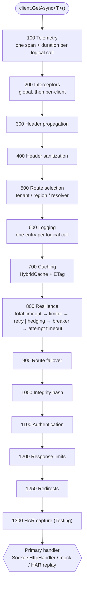
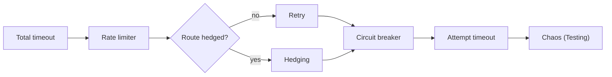

# AwadyLab.HttpKit

A typed `HttpClient` framework for .NET 10+: source-generated registration, a fixed and explainable handler
pipeline, Polly v8 resilience, authentication with token caching, HybridCache response caching, streaming,
SSE and auto-pagination, declarative contracts, and a testing story that needs no running server.


---

## Overview

`AwadyLab.HttpKit` turns every `HttpClient` in an application into a configured, observable, resilient
client without a base class or a runtime scan. You write the client; the source generator registers it; one
ordered pipeline gives it everything else.

There are three packages:

| Package | What it adds |
| :--- | :--- |
| `AwadyLab.HttpKit` | Everything in this document. The source generator and analyzers ship inside it. |
| `AwadyLab.HttpKit.AspNetCore` | Header propagation, `HttpContext` tenant / region / identity, circuit-breaker health checks. |
| `AwadyLab.HttpKit.Testing` | Test doubles, a mock handler, `.mock.json` and `.http` fixtures, HAR capture and replay, chaos injection. |

### Key Highlights

* **Compile-Time Registration**: The source generator finds every client and contract at build time and
  emits a registrar. `AddHttpKit()` registers them with no assembly scanning at run time, and a
  referenced library's clients register themselves.
* **Mistakes Caught in the IDE**: Built-in Roslyn analyzers flag misconfigured clients and contracts as you
  type — conflicting configuration attributes, a streamed client given a buffered definition, an unbound route
  parameter, a paginated POST — with one-click code fixes where the fix is unambiguous. Nothing extra to install.
* **A Pipeline You Can Explain**: Fourteen named slots in a fixed order, each chosen for a reason — caching
  outside resilience so a hit costs nothing, authentication inside retry so every attempt carries a fresh
  credential, size limits innermost so a decompression bomb is stopped before it is in memory. Clients
  cannot reorder it.
* **Streaming That Cannot Be Misconfigured**: A streamed client is handed an options type that has no
  `Resilience`, `Caching` or `Limits` property, so asking for a retried or buffered stream does not compile,
  and a configuration file that asks for it is rejected at startup.
* **Credentials That Stay Out of Everything**: One token cache with single-flight acquisition, proactive
  refresh and failure tolerance; API-key rotation under a lock; redaction applied uniformly to logs, error
  snippets and HAR captures; sensitive headers dropped when a redirect leaves the origin.
* **Low-Allocation Hot Paths**: Header checks, cached-token hand-out and route matching allocate nothing;
  cache keys are hashed without materializing strings; a response body is wrapped once, however many
  features read it.
* **Deterministic Tests**: Every time-dependent behavior runs on `TimeProvider`, so retries, breakers,
  cache expiry, SSE reconnects and chaos latency are tested by advancing a fake clock, not by sleeping.

---

## Installation

```bash
dotnet add package AwadyLab.HttpKit
dotnet add package AwadyLab.HttpKit.AspNetCore   # optional, ASP.NET Core hosts
dotnet add package AwadyLab.HttpKit.Testing      # optional, test projects
```

---

## Quickstart

### 1. Declare a client

No base class and no attributes are required. The constructor takes the configured `HttpClient`.

```csharp
using AwadyLab.HttpKit.Abstractions;
using AwadyLab.HttpKit.Http;

public sealed record Repository(long Id, string Name, string FullName);

public sealed class GitHubClient(HttpClient http) : ITypedHttpClient
{
    public Task<Repository?> GetRepositoryAsync(string owner, string name, CancellationToken ct = default) =>
        http.GetAsync<Repository>($"repos/{owner}/{name}", cancellationToken: ct);
}
```

### 2. Register in DI (`Program.cs`)

```csharp
using MyApp.HttpKit.Generated; // generated per assembly: {AssemblyName}.HttpKit.Generated

var builder = WebApplication.CreateBuilder(args);

builder.Services.AddHttpKit(options =>
{
    options.Configure<GitHubClient>(client => client
        .WithBaseUrl("https://api.github.com/")
        .WithRetry(retry => retry.MaxRetryAttempts = 3));
});

var app = builder.Build();
```

### 3. Inject it

```csharp
app.MapGet("/repos/{owner}/{name}", (string owner, string name, GitHubClient github, CancellationToken ct) =>
    github.GetRepositoryAsync(owner, name, ct));
```

`GetAsync<T>` comes from the package: serialization, error handling, validation and redaction all follow the
client's own configuration. The same helpers work on a plain `HttpClient`, with the defaults.

> [!IMPORTANT]
> `AddHttpKit` can be called **once** per `IServiceCollection`. A second call throws
> `HttpKitConfigurationException` at startup: HttpKit's shared services (serializer, token cache, breaker
> registry) are registered once per host. Put every default, override and provider in that single call, and
> chain add-ons on the `HttpKitBuilder` it returns.

---

## 1. Typed Clients & JSON Helpers

A typed client is any class implementing `ITypedHttpClient` (full pipeline) or `IStreamedHttpClient`
(streaming pipeline, see [section 8](#8-streaming-sse--ndjson)). Inside it, use the `HttpClient` extension
methods:

| Method | Returns | On non-success |
| :--- | :--- | :--- |
| `GetAsync<T>(url)` | `T?` | throws `HttpRequestFailedException` (when `ThrowOnNonSuccess`) |
| `GetOrDefaultAsync<T>(url)` | `T?` | `default` on 404, throws otherwise |
| `GetForResultAsync<T>(url)` | `HttpResult<T>` | never throws on a status |
| `PostJsonAsync<TReq, TRes>(url, body)` / `PostJsonAsync<TReq>(url, body)` | `TRes?` / `Task` | throws |
| `PostJsonForResultAsync<TReq, TRes>(url, body)` | `HttpResult<TRes>` | never throws on a status |
| `PutJsonAsync`, `PatchJsonAsync` | as `PostJsonAsync` | throws |
| `DeleteAsync(url, options)` / `DeleteAsync<T>(url)` | `Task` / `T?` | throws |
| `SendAsync<T>(request)` / `SendForResultAsync<T>(request)` | `T?` / `HttpResult<T>` | as above |
| `SendCheckedAsync(request)` | `HttpResponseMessage` (headers read, body streaming) | throws |
| `CreateJson<TBody>(method, url, body)` | a prepared `HttpRequestMessage` | — |

> [!NOTE]
> `DeleteAsync(url, options)` has no default for `options` on purpose. `HttpClient.DeleteAsync(string)` is an
> instance method and would always win over an extension, silently skipping HttpKit's error handling. Pass
> `null` when there is nothing to configure.

### Per-call options (`RequestOptions`)

Every helper takes an optional `RequestOptions`:

```csharp
var receipt = await http.PostJsonAsync<Order, Receipt>("orders", order, new RequestOptions
{
    IdempotencyKey = Guid.NewGuid().ToString("D"), // makes a POST safe to retry and hedge
    Tenant = "acme",                               // tenant-mapped base URL, auth and cache isolation
    Region = "eu",                                 // region-mapped base URL and auth
    Cache = CacheDirective.Refresh,                // Default, Bypass, Refresh, OnlyIfCached
    SkipValidation = false,                        // skip registered response validators
    Headers = h => h.Add("X-Request-Source", "checkout"),
}, ct);
```

### Results without exceptions (`HttpResult<T>`)

```csharp
var result = await http.GetForResultAsync<User>("users/7", cancellationToken: ct);

if (result.IsSuccess)
    return result.Value;

logger.LogWarning("Lookup failed with {Status}: {Title}", result.StatusCode, result.Problem?.Title);
return result.ValueOrThrow(); // or result.ToException()
```

`HttpResult<T>` carries `StatusCode`, `Method`, `RequestUri` (sensitive query values masked), `Value`,
`Problem` (RFC 9457 problem details, when the server sent them), `BodySnippet` (redacted and size-capped)
and the response headers.

### Error handling

A non-success status raises `HttpRequestFailedException` with the same fields. Problem details are parsed
when the body is `application/problem+json`; any other body is redacted (`Logging.SensitiveBodyFields`) and
capped at `ErrorHandling.MaxErrorBodySnippetBytes` before it reaches an exception, so a server that echoes a
token in an error page never puts it in your logs.

```csharp
options.WithErrorHandling(errors =>
{
    errors.ThrowOnNonSuccess = false; // helpers return default instead of throwing
    errors.MaxErrorBodySnippetBytes = 2 * 1024;
});
```

### Response validation (`IResponseValidator<T>`)

Validators run on every deserialized response of their type, unless the call sets `SkipValidation`:

```csharp
public sealed class UserValidator : IResponseValidator<User>
{
    public ValueTask<ValidationOutcome> ValidateAsync(User value, CancellationToken cancellationToken) =>
        new(string.IsNullOrEmpty(value.Email)
            ? ValidationOutcome.Invalid("Email is required.")
            : ValidationOutcome.Valid);
}

builder.Services.AddHttpKit(...)
    .AddResponseValidator<User, UserValidator>();
```

A failure throws `ResponseValidationException` (with `ResponseType` and `Errors`), or only logs a warning
when `Validation.FailureMode = ValidationFailureMode.Log`.

### Serialization

System.Text.Json with `JsonSerializerDefaults.Web`. Plug in a source-generated context for AOT-friendly,
reflection-free serialization; types it does not know fall back to `JsonOptions`:

```csharp
options.Defaults.WithSerialization(json =>
{
    json.Context = MyJsonContext.Default;
    json.Accept = "application/json";
});
```

Request bodies are serialized into pooled buffers with a known length, so they are sent with
`Content-Length` and can be replayed by retries. Replace the serializer entirely by registering your own
`IHttpSerializer`.

---

## 2. Configuration

### The six layers

A client's options come from up to six layers. Later layers win; every layer is optional.

| # | Layer | Where it is written |
| :--- | :--- | :--- |
| 1 | Defaults | `options.Defaults` (typed) / `options.StreamedDefaults` (streamed) |
| 2 | Definition | `[ConfigureByDefinition(typeof(T))]` → `ITypedHttpClientDefinition.Configure` |
| 3 | Configuration section | `[ConfigureByOptions("Some:Section")]` |
| 4 | Options type | `[ConfigureByOptions(typeof(TOptions))]` → `IOptionsMonitor<TOptions>` |
| 5 | Conventional section | `HttpKit:Clients:{ClientTypeName}` (prefix: `ConfigurationSectionPrefix`) |
| 6 | Code override | `options.Configure<T>(...)`, `ConfigureStreamed<T>(...)`, `ConfigureContract<T>(...)` |

After all six, the options are validated. An invalid value throws `HttpKitConfigurationException` listing
every problem with its option path — at startup, not on the first request. A client carries at most one
`ConfigureBy*` attribute (both is diagnostic **HK0003**, with a code fix); layer anything further with
`Configure<T>()`.

### By definition

A definition is ordinary code, so it can be unit-tested and take constructor dependencies from DI:

```csharp
public sealed class GitHubDefinition : ITypedHttpClientDefinition
{
    public void Configure(HttpKitClientOptions options)
    {
        options.BaseUrl.Address = new Uri("https://api.github.com/");
        options.HeaderPolicy.DefaultHeaders["User-Agent"] = "MyApp";
        options.Auth.Use("github");
        options.Resilience.Retry.MaxRetryAttempts = 3;
        options.Caching.Enabled = true;
    }
}

[ConfigureByDefinition(typeof(GitHubDefinition))]
public sealed class GitHubClient(HttpClient http) : ITypedHttpClient { /* ... */ }
```

A streamed client takes an `IStreamedHttpClientDefinition` instead (pointing it at a typed one is **HK0011**).

### By configuration section

```csharp
[ConfigureByOptions("HttpKit:Clients:Stripe")]
public sealed class StripeClient(HttpClient http) : ITypedHttpClient { /* ... */ }
```

```json
{
  "HttpKit": {
    "Clients": {
      "Stripe": {
        "BaseUrl": { "Address": "https://api.stripe.com/" },
        "Resilience": {
          "Retry": { "MaxRetryAttempts": 2, "Delay": "00:00:00.250" },
          "Timeout": { "Attempt": "00:00:10", "Total": "00:00:30" },
          "CircuitBreaker": { "FailureRatio": 0.5, "BreakDuration": "00:00:30" }
        },
        "Limits": { "MaxResponseBytes": 2097152 }
      }
    }
  }
}
```

Binding uses `ErrorOnUnknownConfiguration`, so a typo in a key is a startup failure rather than a setting
that silently does nothing. It is also how a `Resilience` section under a **streamed** client is caught: its
options type has no such property.

Changes to a bound section flow through `IOptionsMonitor`; the handler chain is rebuilt with the new options
on its next rotation. Circuit breakers and rate limiters survive handler rotation, and reset on an options
reload (the new options may describe a different breaker).

### By options type

```csharp
public sealed class UsersOptions : HttpKitClientOptions;

[ConfigureByOptions(typeof(UsersOptions))]
public sealed class UsersClient(HttpClient http) : ITypedHttpClient { /* ... */ }
```

The type must derive from `HttpKitClientOptions` (`HttpKitStreamedClientOptions` for a streamed client) and is
read through `IOptionsMonitor<T>`, so it reloads with everything else. A type that does not qualify is **HK0005**.

### Fluent shortcuts

The option classes stay plain POCOs so configuration binding works; extension methods give code a
chainable shape:

```csharp
options.Configure<OrdersClient>(client => client
    .WithBaseUrl("https://orders.internal/")
    .WithAuth("orders-oauth")
    .WithTimeouts(attempt: TimeSpan.FromSeconds(5), total: TimeSpan.FromSeconds(20))
    .WithRetry(retry => retry.MaxRetryAttempts = 2)
    .WithCircuitBreaker(breaker => breaker.FailureRatio = 0.25)
    .WithCaching(cache => cache.DefaultTtl = TimeSpan.FromMinutes(1))
    .WithLimits(limits => limits.MaxResponseBytes = 4 * 1024 * 1024)
    .WithIntegrity(signRequests: true, verifyResponses: true)
    .WithDefaultHeader("X-Api-Version", "2")
    .WithInterceptor<AuditInterceptor>());
```

Also available: `WithSerialization`, `WithTls`, `WithProxy`, `WithHandler`, `WithCompression`,
`WithHeaderPolicy`, `WithLogging`, `WithRateLimit`, `WithHedging`, `WithoutResilience`, `WithErrorHandling`.

### Client names

Named `HttpClient` registrations follow one scheme, useful when reading logs, metrics and health checks:

| Client | Name |
| :--- | :--- |
| Typed | `HttpKit:{FullTypeName}` |
| Streamed | `HttpKit:{FullTypeName}#stream` |
| OAuth2 backchannel | `HttpKit:auth:{providerName}` |

---

## 3. The Handler Pipeline

Every client sends through the same ordered chain. Clients change *what* a slot does by configuring its
options, never *where* it runs.



### Why this order

| Slot | Reason for its position |
| :--- | :--- |
| **Telemetry** outermost | One span and one duration cover the whole logical call, retries and cache hits included. Per-attempt spans come from .NET's own `DiagnosticsHandler`. |
| **Interceptors** early | First to see the request, last to see the response: they can short-circuit before any work and observe the final outcome. |
| **Header propagation** before **sanitization** | Headers copied from an incoming request are not automatically trustworthy; they pass the same policy as everything else. |
| **Route selection** before **logging** | The log entry carries the URL the request actually went to. |
| **Caching** outside **resilience** | A cache hit costs no rate-limiter permit, no breaker bookkeeping and no retry budget. |
| **Resilience** | Retry and hedging are alternatives, never both: a hedged route is not retried, since doing both multiplies load when the server is already struggling. |
| **Route failover** inside resilience | Attempt *n* can go to a different endpoint than attempt *n−1*. |
| **Integrity hash** per attempt | The digest covers the exact bytes each attempt sends. |
| **Authentication** inside retry | Every attempt applies a current credential, so a token expiring mid-retry is a non-event. A 401 (or 403 for API keys) triggers exactly one re-send with a new credential. |
| **Response limits** innermost | The guard counts decompressed bytes as they arrive — the only position that can stop a decompression bomb before it is in memory. |
| **Redirects** below authentication | HttpKit follows redirects itself and drops every `HeaderPolicy.SensitiveHeaders` header when a redirect leaves the origin (`SocketsHttpHandler` strips only `Authorization`). HTTPS → HTTP is never followed. |

### The streamed pipeline

A streamed client gets a strict subset — everything that would buffer or replay the stream is left out:

```
Telemetry → Interceptors → HeaderPropagation → HeaderSanitization → RouteSelection
→ Logging (headers only) → Authentication (no challenge re-send) → Redirects → HarCapture (headers only)
```

### Filling a slot (`IHandlerPipelineContributor`)

Add-on packages add handlers to a named slot instead of inserting themselves anywhere:

```csharp
internal sealed class ApiVersionContributor : IHandlerPipelineContributor
{
    public void Contribute(HandlerPipelineContext context)
    {
        if (context.HasSlot(HandlerSlot.Interceptors))
            context.Add(HandlerSlot.Interceptors, new ApiVersionHandler());
    }
}

builder.Services.AddHttpKit(...).AddPipelineContributor<ApiVersionContributor>();
```

Adding to a slot a streamed client does not have **throws** rather than silently dropping the handler: a
security handler that quietly disappears is worse than a startup error.

---

## 4. Resilience

One Polly v8 pipeline per client, built in a fixed order:



### Retry & backoff

```csharp
options.WithRetry(retry =>
{
    retry.MaxRetryAttempts = 3;
    retry.Backoff = BackoffKind.Exponential; // Constant, Linear, Exponential
    retry.Delay = TimeSpan.FromMilliseconds(200);
    retry.MaxDelay = TimeSpan.FromSeconds(10);
    retry.UseJitter = true;
    retry.HonorRetryAfter = true;
});
```

* **What is retried**: 408, 429, 500, 502, 503, 504 and network failures — the statuses that mean "try
  again", not every 5xx. Edit the set with `RetryOnStatusCodes`.
* **`Retry-After`** is honored in both forms (delta-seconds and HTTP-date) and capped at `MaxDelay`, so a
  server asking for an hour does not park a request for an hour.
* **Idempotency**: GET, HEAD, OPTIONS, PUT, DELETE and TRACE are retried on their own. A POST or PATCH is
  retried only when it carries an `Idempotency-Key` (`RequestOptions.IdempotencyKey`), per
  `Retry.Idempotent` (`Never`, `WithIdempotencyKey`, `Always`).
* **Replay safety**: a streamed upload body cannot be replayed, so such a request is never retried or hedged.
  Buffered bodies (JSON, forms, byte arrays) are.

### Timeouts

`Timeout.Attempt` bounds one attempt; `Timeout.Total` bounds the whole call including retries. Both raise
`HttpKitTimeoutException`, whose `Scope` (`Attempt` or `Total`) says which one elapsed. `HttpClient.Timeout`
itself is set to infinite because it cannot tell the two apart.

### Circuit breaker

```csharp
options.WithCircuitBreaker(breaker =>
{
    breaker.FailureRatio = 0.5;
    breaker.MinimumThroughput = 20;
    breaker.SamplingDuration = TimeSpan.FromSeconds(30);
    breaker.BreakDuration = TimeSpan.FromSeconds(30);
});
```

The breaker is **shared** by a client's standard and hedging pipelines and survives handler rotation, so a
rotation never silently resets a tripped circuit. An open circuit raises `HttpKitCircuitOpenException`
(with `RetryAfter`). Operators can force a circuit open or closed through `ICircuitBreakerStateRegistry`
(`IsolateAsync`, `CloseAsync`, `GetSnapshot`, `GetAll`), and the state is exposed as a health check.

### Rate limiting & concurrency

```csharp
options.WithRateLimit(limit =>
{
    limit.MaxConcurrentRequests = 100;
    limit.QueueLimit = 50;
    limit.TokenBucket = new TokenBucketOptions
    {
        TokenLimit = 1000,
        TokensPerPeriod = 1000,
        ReplenishmentPeriod = TimeSpan.FromSeconds(1),
    };
});
```

A rejected call raises `HttpKitRateLimitedException` instead of queueing forever. The limiter sits outside
retry, so a retry does not take a second permit.

### Hedging

Hedging sends a second request while the first is still in flight and takes whichever answers first. It is
opt-in **per route**, because it multiplies load:

```csharp
options.WithHedging([HttpMethod.Get], "/search/**", maxHedgedAttempts: 2, delay: TimeSpan.FromMilliseconds(300));
```

* **Patterns**: `*` matches one path segment, `**` any number; matched case-insensitively against the
  absolute path. Routes are compiled at startup and matched without allocating.
* **Non-idempotent verbs** follow `Hedging.Idempotent` (`WithIdempotencyKey` by default). A hedged route
  that could never hedge under the policy is rejected at startup.
* **Fallback is logged**: a request that matches a hedged route but cannot be hedged (no idempotency key, a
  body that cannot be replayed) goes through the standard pipeline and logs a warning naming the route and
  the reason — a route that quietly never hedges should not have to be found from a latency graph.
* **Losers are cleaned up**: attempts that lose are cancelled and their responses disposed.

### Failover

`BaseUrl.Fallbacks` gives a client a list of endpoints. Attempt 0 goes to the primary, attempt *n* to
fallback *n−1*, and the last endpoint is reused once the list is exhausted. Path and query are preserved;
only the authority changes. With hedging, concurrent attempts go to different endpoints.

```csharp
options.BaseUrl.Address = new Uri("https://api-eu-1.example.com/");
options.BaseUrl.Fallbacks.Add(new Uri("https://api-eu-2.example.com/"));
```

### Turning it off

`WithoutResilience()` (`Resilience.Enabled = false`) removes the Polly pipeline entirely: no retry, breaker,
limiter or timeout — and no chaos injection, which rides in the same pipeline. Streamed clients never have one.

---

## 5. Authentication

Providers are registered **once, by name**, in `options.Auth`; each client picks one. The provider runs
inside the retry loop, so every attempt carries a current credential.

```csharp
builder.Services.AddHttpKit(options =>
{
    options.Auth.AddOAuth2ClientCredentials("github", oauth =>
    {
        oauth.TokenEndpoint = new Uri("https://github.com/login/oauth/access_token");
        oauth.ClientId = builder.Configuration["GitHub:ClientId"];
        oauth.ClientSecret = builder.Configuration["GitHub:ClientSecret"];
        oauth.Scope = "repo:read";
    });

    options.Configure<GitHubClient>(client => client.Auth.Use("github"));
});
```

### Built-in providers

| Provider | Registration | What it sends |
| :--- | :--- | :--- |
| Static bearer | `AddStaticBearer(name, token, scheme = "Bearer")` | `Authorization: Bearer <token>` |
| Delegate bearer | `AddBearer(name, acquire, configure?)` | a token your delegate fetches, cached and refreshed |
| OAuth2 client credentials | `AddOAuth2ClientCredentials(name, configure)` | an RFC 6749 §4.4 token, cached and refreshed |
| Static API key | `AddStaticApiKey(name, key, configure?)` | a header or query parameter with a fixed key |
| Rotating API key | `AddRotatingApiKey(name, configure?, params keys)` | a header or query parameter, rotated on rejection |

### Token caching

One cache entry per provider (per tenant when `PerTenant = true`), with three properties worth relying on:

* **Single Flight**: a hundred concurrent callers on a cold cache produce one token request, not a hundred.
* **Proactive Refresh**: a token is refreshed *before* it expires, in the background, while the current one
  keeps being served. The window is the smaller of `RefreshWindow` and `RefreshFraction` × lifetime, so a
  short-lived token is not refreshed on every call.
* **Failure Tolerance**: if a refresh fails while the current token is still valid, it keeps being served
  and the failure is logged. Only an actually expired token makes callers wait.

```csharp
oauth.CachePolicy = new TokenProviderCachePolicy(TimeSpan.FromMinutes(5), RefreshFraction: 0.1);
oauth.Method = ClientAuthenticationMethod.Basic; // Basic, Post, ClientAssertion
```

### The OAuth2 backchannel

A token endpoint is itself an HTTP call, so it gets its own HttpKit client (`HttpKit:auth:{provider}`) with
its own TLS, proxy and resilience settings:

```csharp
oauth.ConfigureBackchannel = backchannel =>
{
    backchannel.Resilience.Retry.MaxRetryAttempts = 2;
    backchannel.Tls.EnabledProtocols = SslProtocols.Tls13;
};
```

Two things are refused with `HttpKitConfigurationException`: configuring authentication on the backchannel
(it would recurse), and enabling redirects on it (a 307 would re-send the client secret in the body to the
redirect target — RFC 9700 §4.11).

### API keys & rotation

```csharp
options.Auth.AddRotatingApiKey("stripe",
    key =>
    {
        key.Placement = ApiKeyPlacement.Header; // or QueryParameter
        key.Name = "Authorization";
        key.Prefix = "Bearer ";
    },
    _ => new ValueTask<ApiKey>(new ApiKey(primary, KeyId: "primary", NotAfter: primaryExpiry)),
    _ => new ValueTask<ApiKey>(new ApiKey(secondary, KeyId: "secondary")));
```

Keys come from delegates so they can live in a secret store. When the server rejects a key (401 or 403) the
provider rotates **under a lock**: a hundred concurrent rejections cause one rotation, and each request is
re-sent once with the new key. A key past its `NotAfter` is replaced before it is ever sent. Header and
query names used for keys are added to the redaction sets automatically.

### Per-tenant, per-region and per-route providers

```csharp
options.Tenants.AuthProviders["acme"] = "acme-oauth";   // tenant → provider
options.Regions.AuthProviders["us"] = "us-oauth";       // region → provider
options.Auth.UseResolver<MyAuthenticationResolver>();  // IAuthenticationResolver: any rule you like
```

An `IAuthenticationResolver` returning `null` falls back to the client's own provider.

### What never happens

Credentials do not appear in exceptions, log entries, HAR captures or error snippets. Every header in
`HeaderPolicy.SensitiveHeaders` (`Authorization`, `Proxy-Authorization`, `Cookie`, `Set-Cookie`,
`X-Api-Key`, `Api-Key`, `X-Auth-Token` by default) goes through the redactor wherever it could be written
out. Exceptions name the *provider*, never the credential.

---

## 6. Response Caching

Responses are cached in [HybridCache](https://learn.microsoft.com/aspnet/core/performance/caching/hybrid),
so an L1 in-memory cache and an optional L2 distributed cache come for free.

```csharp
builder.Services.AddHybridCache();

options.Configure<CatalogClient>(client => client.WithCaching(cache =>
{
    cache.DefaultTtl = TimeSpan.FromMinutes(5);
    cache.Revalidation = RevalidationStrategy.WhenStale;
    cache.StaleWhileRevalidate = TimeSpan.FromMinutes(1);
}));
```

Enabling caching without a registered `HybridCache` throws at startup with a message naming `AddHybridCache`.

### What is cached

* **Methods**: GET and HEAD (`CacheableMethods`). POST, PUT, PATCH and DELETE never are.
* **Statuses**: those RFC 9111 §4.2.2 defines as heuristically cacheable — **200, 203, 204, 300, 301, 404,
  410**. A "not found" is as re-usable an answer as a "here it is".
* **Headers**: `Cache-Control: no-store` and `private` bypass the cache; `max-age` / `s-maxage` set the TTL;
  `Vary: *` is never stored.
* **Size**: bodies up to `MaxCacheableBodyBytes` (1 MB). A larger body — even one without `Content-Length` —
  is read only up to the limit and then handed to the caller untouched, never fully buffered.

### Cache keys

`hk:{client}:{METHOD}:{scheme}://{host}{path}:{sha256}`, where the hash covers the selected query parameters
(sorted, so order never changes the key), the selected request headers and the isolation parts.
Components are escaped before hashing, so a crafted value can never pass for two components.

```csharp
cache.KeyQueryParameters.Clear();
cache.KeyQueryParameters.Add("q");            // default is "*": every parameter
cache.KeyHeaders.Add("Accept-Language");
```

**A cached response is never shared across callers or tenants.** `IncludeTenant` and `IncludeAuthContext`
(both on by default) add the tenant and a hash of the caller's identity to the key. `IncludeAuthContext` also
covers credentials HttpKit did not add: the key includes an HMAC fingerprint of every sensitive header on
the request, under a key that lives only in the process, so two users with different tokens never share an
entry and a key that leaks into a log does not let anyone test guesses of a credential.

`UseResponseVary` (on by default) adds a second lookup level: the response's `Vary` header decides which
request headers select a variant.

### Revalidation & ETags

| `Revalidation` | Behavior |
| :--- | :--- |
| `Never` | serve until the TTL expires, then refetch |
| `WhenStale` (default) | on expiry, revalidate with `If-None-Match` / `If-Modified-Since` |
| `Always` | revalidate on every call (a 304 still saves the body transfer) |
| `ServeStaleOnError` | like `WhenStale`, but serve the stale entry when the origin answers 5xx or fails |

A 304 merges the new headers into the entry and refreshes its TTL without transferring the body.
`StaleWhileRevalidate` serves a stale entry immediately and refreshes once in the background, single-flight.

### Per-request control

```csharp
await http.GetAsync<User>("users/7", new RequestOptions { Cache = CacheDirective.Refresh });
```

| `CacheDirective` | Behavior |
| :--- | :--- |
| `Default` | normal lookup |
| `Bypass` | ignore the cache and do not write to it |
| `Refresh` | ignore what is cached, fetch, and store the result |
| `OnlyIfCached` | return the cached entry or fail; never touch the network |

### Invalidation

```csharp
await http.InvalidateCachedAsync("users/7");         // one entry
await http.InvalidateCachedPrefixAsync("users/7");   // everything under a path
await http.InvalidateCachedByTagAsync("catalog");    // everything with a tag
await http.InvalidateAllCachedAsync();               // everything this client cached
```

The full surface is `IHttpResponseCacheInvalidator` (`InvalidateByKeyAsync`, `InvalidateByTagAsync`,
`InvalidateByUrlPrefixAsync`, `InvalidateClientAsync`, `InvalidateRequestAsync`). Entries are tagged with
`client:{name}`, one `url:` tag per path segment, `GlobalTags`, and whatever `TagsFromRequest` returns.

### Customizing keys

| Extension point | Purpose |
| :--- | :--- |
| `ICacheContextContributor` | add isolation parts to every key (a feature flag, an API version) — `AddCacheContextContributor<T>()` |
| `ICacheKeyStrategy` | replace the key layout entirely — register your own in DI |

---

## 7. Routing: Tenants, Regions & Resolvers

The base address can depend on the tenant or region of the call, or on any rule you write:

```csharp
options.Configure<BillingClient>(client =>
{
    client.BaseUrl.Address = new Uri("https://billing.example.com/");       // fallback
    client.Tenants.BaseUrls["acme"] = new Uri("https://acme.billing.example.com/");
    client.Regions.BaseUrls["eu"] = new Uri("https://eu.billing.example.com/");
    client.Tenants.Source = TenantSource.RequestThenAmbient;
});

await billing.GetInvoiceAsync(id, new RequestOptions { Tenant = "acme" });
```

* **Tenant source**: `RequestThenAmbient` (default), `RequestOnly` or `AmbientOnly`. The ambient tenant comes
  from `ITenantAccessor` (`AmbientTenantAccessor.Use(...)` outside a web request); in ASP.NET Core,
  `AddHttpContextTenant()` reads it from the current request.
* **Region** works the same way through `IRegionAccessor`, `RequestOptions.Region` and `Regions.Default`.
  When both maps are set, the tenant map decides.
* **Custom routing**: `client.BaseUrl.UseResolver<TResolver>()` with an `IBaseUrlResolver` that returns a
  `RouteSelection` (primary endpoint plus fallbacks) per request.

A client that routes by tenant refuses a call that carries **no** tenant, and an unmapped tenant or region
with no `BaseUrl.Address` to fall back on is refused too: both raise `RouteResolutionException` rather than
sending a tenant's request to a shared endpoint.

---

## 8. Streaming, SSE & NDJSON

A client that consumes a stream implements `IStreamedHttpClient`. It gets the reduced pipeline and
`HttpKitStreamedClientOptions`, which have no `Resilience`, `Caching`, `Limits`, `Validation` or `Integrity`.

```csharp
public sealed class EventsDefinition : IStreamedHttpClientDefinition
{
    public void Configure(HttpKitStreamedClientOptions options)
    {
        options.BaseUrl.Address = new Uri("https://events.example.com/");
        options.ConnectTimeout = TimeSpan.FromSeconds(10);
    }
}

[ConfigureByDefinition(typeof(EventsDefinition))]
public sealed class EventsClient(HttpClient http) : IStreamedHttpClient
{
    public IAsyncEnumerable<SseEvent> WatchAsync(CancellationToken ct = default) =>
        http.GetServerSentEventsAsync("events", new SseOptions { MaxReconnects = 5 }, ct);

    public IAsyncEnumerable<User?> StreamUsersAsync(CancellationToken ct = default) =>
        http.GetNdjsonAsync<User>("users.ndjson", cancellationToken: ct);
}
```

| Method | What it gives you |
| :--- | :--- |
| `OpenStreamAsync(url)` / `SendStreamAsync(request)` | `HttpStreamResponse` with the body `Stream` and a `PipeReader` |
| `PostStreamAsync(url, stream, contentType)` / `PutStreamAsync(...)` | uploads without buffering |
| `GetNdjsonAsync<T>(url)` / `SendNdjsonAsync<T>(request)` | `IAsyncEnumerable<T?>`, one item per line; a line longer than `Serialization.MaxNdjsonLineBytes` (16 MB) is refused |
| `GetJsonArrayStreamAsync<T>(url)` | `IAsyncEnumerable<T?>` over a JSON array |
| `GetServerSentEventsAsync(url, options)` | `IAsyncEnumerable<SseEvent>` |

Every one sends with `HttpCompletionOption.ResponseHeadersRead`, so items arrive before the response
completes. `HttpClient.Timeout` is infinite — a long-lived stream is not a stalled request — and time is
bounded by `ConnectTimeout` and the caller's cancellation token. Dispose the enumerator or cancel to release
the connection.

### Server-sent events

```csharp
var sse = new SseOptions
{
    AutoReconnect = true,
    ReconnectDelay = TimeSpan.FromSeconds(3),
    MaxReconnects = 5,
    LastEventId = checkpoint,
};
```

Parsing uses the BCL `SseParser`. A dropped connection reconnects with `Last-Event-ID` set to the last event
seen, so the server resumes instead of replaying; a `retry:` field updates the delay. Delays run on
`SseOptions.TimeProvider`.

> [!NOTE]
> Using a streaming helper from a *buffered* client still works, but the stream goes through the buffering
> pipeline — the analyzer warns with **HK0020**.

---

## 9. Auto-Pagination

```csharp
await foreach (var repo in http.GetPagedAsync(
    "orgs/acme/repos?per_page=100",
    new LinkHeaderPagination<Repository>(),
    new PaginationOptions { MaxPages = 10, MaxItems = 1_000 },
    ct))
{
    // the next page is fetched only once this one has been consumed
}
```

| Strategy | Follows |
| :--- | :--- |
| `LinkHeaderPagination<T>` | RFC 8288 `Link: <…>; rel="next"` (`ItemsPath` for a wrapped array) |
| `CursorInBodyPagination<T>` | a cursor in the body (`CursorPath`, `HasMorePath`), sent back as `CursorParameter` |
| `OffsetLimitPagination<T>` | `offset`/`limit` or page numbers (`ByPageNumber`), stopping on a short page or `TotalPath` |

* **Every page goes through the full pipeline** — auth, resilience and caching apply per page.
* **Guards**: `MaxPages` (1,000 by default) and `MaxItems` bound a runaway enumeration, and a server that hands
  back a page already fetched (a repeated cursor or a `Link` cycle) fails with `InvalidOperationException`
  instead of being called again.
* **Custom strategies** implement `IPaginationStrategy<T>`. `QueryString.SetParameter(uri, name, value)` sets
  one query parameter on an absolute or relative URI, as the built-in strategies do.

---

## 10. Forms, Multipart & Files

These use the same pipeline as JSON: auth, resilience, logging and size limits all apply.

### Form-urlencoded

```csharp
var charge = await http.PostFormDataAsync<Charge>(
    "v1/charges",
    form => form.Add("amount", 1999).Add("currency", "eur").AddIfNotNull("description", note),
    new RequestOptions { IdempotencyKey = key },
    ct);
```

`FormUrlEncodedBuilder` escapes names and values; `AddIfNotNull` skips a pair instead of sending it empty.
The body is buffered, which is what makes the request safe to retry.

### Multipart

```csharp
var upload = await http.PostMultipartAsync<UploadResult>("documents", parts => parts
    .AddField("title", "Q3 report")
    .AddJson("metadata", metadata)                              // through the client's serializer
    .AddFile("document", new FileInfo("report.pdf"))            // content type from the extension
    .AddFile("thumbnail", "thumb.png", thumbnailStream, "image/png"),
    cancellationToken: ct);
```

File parts are streamed, not read into memory. `AddPart` takes any `HttpContent`. A multipart body with a
non-seekable stream cannot be replayed, so that request is not retried or hedged.

### Uploading one file

```csharp
var result = await http.UploadFileAsync<UploadResult>("documents", FileUpload.FromPath("report.pdf"), cancellationToken: ct);
```

`FileUpload.FromPath`, `FromStream` and `FromBytes` take the field name (`file` by default) and an optional
content type.

### Downloading to disk

```csharp
await using var download = await http.DownloadFileAsync("documents/7/content", new FileDownloadOptions
{
    TargetDirectory = cacheDirectory,
    MaxBytes = 100 * 1024 * 1024,
    DeleteOnDispose = true,
}, ct);

Console.WriteLine($"{download.FileName} ({download.Length} bytes) at {download.Path}");
await using var stream = download.OpenRead();
```

The response streams straight to disk and the size limit is enforced while writing, so an oversized response
stops part-way. The file name comes from `Content-Disposition` (including RFC 5987 `filename*`) and is
sanitized before it touches the file system. A failed or cancelled download removes the partial file.

---

## 11. Declarative Contracts

For endpoints that are nothing but a URL and a shape, declare an interface; the generator writes the
implementation, and `AddHttpKit()` registers it.

```csharp
[HttpKitContract(BasePath = "api")]
[ConfigureByOptions("HttpKit:Clients:Users")]
public interface IUsersApi
{
    [Get("users/{id}")]
    Task<User?> GetAsync(int id, CancellationToken cancellationToken = default);

    [Get("users")]
    Task<User[]?> SearchAsync(string? q, int? limit, CancellationToken cancellationToken = default);

    [Post("users")]
    Task<User?> CreateAsync([Body] User user, CancellationToken cancellationToken = default);

    [Get("users")]
    [Paginated(typeof(OffsetLimitPagination<User>))]
    IAsyncEnumerable<User> ListAllAsync(CancellationToken cancellationToken = default);
}
```

The generated code calls the same extension methods a hand-written client would, so a contract gets the
identical pipeline with no runtime proxy or reflection. Contracts are deliberately simple: anything with real
logic belongs in a typed client.

### Binding parameters

| Attribute | Binds to |
| :--- | :--- |
| `[Path("name")]` | the `{name}` placeholder, escaped with `Uri.EscapeDataString` |
| `[Query("name")]` | a query parameter; `null` is omitted, collections repeat the parameter |
| `[Header("Name")]` | a request header; `null` means "not set" |
| `[Body]` | the request body, serialized by the client's serializer |

Without an attribute, a parameter matching a route placeholder is a path value and any other simple type is
a query parameter; a complex type without an attribute is an error (**HK0104**) rather than a guess. A
`CancellationToken` is passed through, and a `RequestOptions` parameter is applied to the request. Values are
formatted invariantly (`true`/`false`, round-trip dates, `Guid` as `D`, `TimeSpan` as `c`).

Verbs: `[Get]`, `[Post]`, `[Put]`, `[Patch]`, `[Delete]`, `[Head]`. `[Idempotent]` marks a non-idempotent
method as safe to re-send (needed for a paginated `POST`, **HK0107**).

### Return types

| Return type | Behavior |
| :--- | :--- |
| `Task` | sends and discards the body; throws on failure |
| `Task<T>` | deserializes the body |
| `Task<HttpResult<T>>` | never throws on a status |
| `Task<HttpResponseMessage>` | headers read, body still streaming; the caller owns it |
| `Task<FileDownload>` | streams to disk |
| `IAsyncEnumerable<T>` with `[Paginated]` | walks every page |

### Building a URL by hand

Generated code uses `ContractRequestBuilder`, which is public — useful for hand-written clients that should
format values the same way:

```csharp
var url = new ContractRequestBuilder("users/{id}/posts", "api")
    .Path("id", 7)
    .Query("q", "ada")
    .Query("tags", new[] { "one", "two" })
    .Build();   // api/users/7/posts?q=ada&tags=one&tags=two
```

---

## 12. Interceptors & Extensibility

### Interceptors (`IHttpInterceptor`)

An interceptor sees every request before the pipeline and every response after it. Implement only the side
you need; both have no-op defaults. Returning a response from `OnRequestAsync` short-circuits the call —
nothing further runs, not even the transport.

```csharp
public sealed class AuditInterceptor(ILogger<AuditInterceptor> logger) : IHttpInterceptor
{
    public ValueTask<HttpResponseMessage> OnResponseAsync(HttpRequestMessage request, HttpResponseMessage response,
        HttpKitClientRuntime runtime, CancellationToken cancellationToken)
    {
        logger.LogInformation("{Client} answered {Status}", runtime.ClientName, (int)response.StatusCode);
        return new(response);
    }
}

builder.Services.AddHttpKit(...)
    .AddInterceptor<AuditInterceptor>();                          // every client, first
// or per client: options.Configure<OrdersClient>(c => c.WithInterceptor<AuditInterceptor>());
```

Global interceptors run before per-client ones, each in registration order.

### Extension points

| Interface | Default | Purpose |
| :--- | :--- | :--- |
| `IHttpInterceptor` | none | observe, modify or short-circuit calls — `AddInterceptor<T>()` |
| `IResponseValidator<T>` | none | validate deserialized responses — `AddResponseValidator<T, TValidator>()` |
| `IOutgoingHeaderContributor` | none | add headers to every request — `AddHeaderContributor<T>()` |
| `IHandlerPipelineContributor` | core handlers | fill a pipeline slot — `AddPipelineContributor<T>()` |
| `IPrimaryHandlerProvider` | `SocketsHttpHandler` | supply the transport for some clients — `AddPrimaryHandlerProvider<T>()` |
| `ICacheContextContributor` | tenant, auth context | add cache-key isolation — `AddCacheContextContributor<T>()` |
| `ICacheKeyStrategy` | `hk:…:{sha256}` | replace the cache key layout |
| `IHttpSerializer` | System.Text.Json | replace body serialization |
| `IHeaderRedactor` / `IBodyRedactor` | mask sensitive values | change what redaction looks like |
| `ITenantAccessor` / `IRegionAccessor` | none | the ambient tenant / region |
| `IAuthContextAccessor` | none | the caller identity for cache isolation |
| `IAuthenticationResolver` | client's provider | pick a provider per call |
| `IBaseUrlResolver` | tenant / region maps | pick endpoints per call |
| `TimeProvider` | `TimeProvider.System` | every delay, expiry and timeout |

`AddAmbientHeaderPropagation()` propagates headers from an ambient scope outside ASP.NET Core.

---

## 13. Security Defaults

| Area | Default |
| :--- | :--- |
| **TLS** | TLS 1.2 and 1.3 only; revocation checked. `PinnedCertificateThumbprints` pins certificates; `ClientCertificates` / `ClientCertificateProvider` do mTLS. |
| **Certificate validation** | Strict. `DangerousAcceptAnyServerCertificate` only takes effect when `AcknowledgeDangerousMode` holds the exact phrase in `TlsOptions.DangerousModeAcknowledgement`, and it logs at `Critical`. |
| **Header policy** | CR, LF and NUL rejected; transport-owned headers forbidden; `Host` override off; request header size and count capped — see [Header policy](#header-policy-slot-400) below. |
| **Size limits** | 64 MB request body, 64 MB response, 256 MB after decompression — counted as bytes arrive. `RequestTooLargeException` / `ResponseTooLargeException`. |
| **Redirects** | Followed by HttpKit (up to 10); sensitive headers dropped when leaving the origin; HTTPS → HTTP refused. |
| **Integrity** | Opt-in RFC 9530 `Content-Digest`: `SignRequests` hashes the body of each attempt, `VerifyResponses` checks the body as it is read and raises `IntegrityCheckFailedException` — a tampered body is never cached. |
| **Logging** | Bodies and headers off. When on, sensitive headers, JSON/form fields (`password`, `token`, `client_secret`, …) and query parameters (`api_key`, `token`, `signature`, …) are masked. |
| **Errors** | RFC 9457 problem details; any other body is redacted and capped before it reaches an exception. |

### Header policy (slot 400)

Every header name and value on every request — the client's own, `DefaultHeaders`, interceptors' and
propagated ones alike — is checked before the request leaves, and every response header before the response
is handed back. The first violation raises `HeaderPolicyViolationException` with the header name, the reason
and the option to change; the value itself is never in the message.

| Check | Requests | Responses |
| :--- | :--- | :--- |
| **Header injection**: CR, LF or NUL in a name or value | rejected | rejected |
| **Transport-owned headers**: `Content-Length`, `Transfer-Encoding`, `Connection`, `Upgrade`, `Proxy-Connection`, `Proxy-Authenticate` (`ForbiddenHeaders`) | rejected | — |
| **`Host` override** (unless `AllowHostOverride`) | rejected | — |
| **Forbidden response headers** (`ForbiddenResponseHeaders`, empty by default) | — | rejected |
| **Value length** | `MaxRequestHeaderValueLength` (8 KB) | `MaxResponseHeaderValueLength` (off) |
| **Total size** | `MaxRequestTotalHeaderBytes` (32 KB) | `MaxResponseTotalHeaderBytes` (off) |
| **Value count** | `MaxRequestHeaderCount` (100) | `MaxResponseHeaderCount` (off) |

Content headers count too. Response limits are off by default because servers legitimately send headers a
request never would (a long `Content-Security-Policy`, dozens of `Set-Cookie`); the transport still caps all
response headers at `Handler.MaxResponseHeadersLength` (64 KB). The injection scan is vectorized
(`SearchValues`) and allocation-free, so it costs well under a microsecond per request.

```csharp
options.WithHeaderPolicy(policy =>
{
    policy.ForbiddenResponseHeaders.Add("X-Debug-Token");
    policy.MaxResponseHeaderCount = 200;
    policy.SensitiveHeaders.Add("X-Session");   // redacted everywhere, isolates cache entries, dropped cross-origin
});
```

`ForbiddenHeaders` and `SensitiveHeaders` can be added to but not emptied: a layer of configuration can make
the policy stricter, never quietly weaker. `HeaderPolicy.Enabled = false` switches the checks off for a client.

---

## 14. Observability

### Logging

One structured entry per logical call (method, redacted URL, status, duration, attempts, cache outcome),
with optional per-attempt entries inside the resilience pipeline:

```csharp
options.Defaults.WithLogging(log =>
{
    log.Level = LogLevel.Information;
    log.LogHeaders = true;          // at Debug; sensitive values are masked
    log.LogBodies = true;           // at Debug; only LoggableContentTypes, up to MaxBodyBytes, redacted
    log.LogEachAttempt = true;      // a slim entry per retry / hedge
    log.SensitiveQueryParameters.Add("session");
});
```

`Level` applies to successful calls. A 4xx always logs at `Warning` and a 5xx at `Error`, so raising `Level`
never hides a failure. Headers and bodies are written only when `Debug` is enabled for the category.

### Tracing & metrics

Both signals come from one source named `AwadyLab.HttpKit` (`HttpKitTelemetry.Name`), so one line each
subscribes OpenTelemetry to all of it:

```csharp
builder.Services.AddOpenTelemetry()
    .WithTracing(t => t.AddSource(HttpKitTelemetry.Name))
    .WithMetrics(m => m.AddMeter(HttpKitTelemetry.Name));
```

**Tracing.** One `HttpKit.Send` activity per logical call — retries, hedges and cache lookups included — so a
trace shows the call as the caller saw it. The per-attempt HTTP spans (and `traceparent` propagation) come from
.NET's own `System.Net.Http` instrumentation beneath it.

**Metrics** (`HttpKitMetrics`, instruments on the `AwadyLab.HttpKit` meter):

| Instrument | Type | Recorded | Tags |
| :--- | :--- | :--- | :--- |
| `httpkit.client.request.duration` | histogram, seconds | once per logical call | client, method, status, cache outcome, error type, `GeneralTags` |
| `httpkit.client.requests` | counter | once per logical call | same as above |
| `httpkit.client.cache` | counter | every cache decision | client, outcome: `hit`, `miss`, `revalidated`, `stale`, `stale-on-error`, `bypass` |
| `httpkit.client.retries` | counter | every retry attempt | client |
| `httpkit.client.hedges` | counter | every hedged attempt | client |
| `httpkit.client.circuit_opened` | counter | every time a breaker opens | client |
| `httpkit.client.token_acquisitions` | counter | every real token acquisition (not cache hits) | auth provider |

**Tags** (`TelemetryTags`) follow the OpenTelemetry HTTP semantic conventions where one exists:

| Tag | Meaning |
| :--- | :--- |
| `httpkit.client` | client name, e.g. `HttpKit:MyApp.GitHubClient` |
| `http.request.method` | `GET`, `POST`, … |
| `http.response.status_code` | status of the final response |
| `url.full` | the request URL with sensitive query values masked (span only) |
| `server.address` | host (span only) |
| `httpkit.cache.outcome` | the cache outcome |
| `httpkit.attempts` | attempts made for the call (span only) |
| `error.type` | exception type when the call failed |
| `httpkit.auth.provider` | provider name, on token acquisitions |

Useful alerts fall straight out of these: retry and hedge rates per client, `circuit_opened` for flapping
dependencies, `token_acquisitions` for a provider hammering its token endpoint, and the cache counter's
hit ratio.

`Telemetry.GeneralTags` adds your own tags to the span and the request metrics of a client;
`EnableTracing` and `EnableMetrics` switch those off per client.

### Health checks

```csharp
builder.Services.AddHealthChecks().AddHttpKitHealthChecks();
```

Closed is `Healthy`, half-open `Degraded` (`DegradedWhenHalfOpen`), open or isolated `Unhealthy`
(`OpenStatus`). The payload names each client, its state, when it opened and the failure that tripped it.
`AddHttpKitClientHealthChecks(clientNames)` registers one check per client, so a dashboard shows *which*
dependency is failing.

---

## 15. ASP.NET Core (`AwadyLab.HttpKit.AspNetCore`)

```csharp
using AwadyLab.HttpKit.AspNetCore;

var httpKit = builder.Services.AddHttpKit(...);

httpKit.AddAspNetCore(propagation =>
{
    propagation.Headers.Add("X-Correlation-Id");
    propagation.Headers.Add("X-Request-Id");
});
builder.Services.AddHealthChecks().AddHttpKitHealthChecks();

var app = builder.Build();
app.UseHeaderPropagation();
```

`AddAspNetCore` is shorthand for four registrations you can also make one by one:

| Registration | What it does |
| :--- | :--- |
| `AddHttpKitHeaderPropagation(configure)` | copies the configured incoming headers onto every HttpKit call; they pass the header policy, and a header the caller set already wins |
| `AddHttpContextTenant(configure)` | reads the tenant from a claim (`tenant`), header (`X-Tenant-Id`), route value (`tenant`) or host prefix, in the order of `Sources` |
| `AddHttpContextRegion(configure)` | reads the region from a header (`X-Region`) or claim (`region`) |
| `AddHttpContextAuthContext()` | puts the caller's identity in cache keys, so a cached response is never served to another user |

---

## 16. Testing (`AwadyLab.HttpKit.Testing`)

The Testing package replaces a client's **transport** without touching the rest of its pipeline, so a test
still exercises the real serialization, auth, resilience and caching.

```csharp
var httpKit = services.AddHttpKit(options =>
{
    // Per-client testing settings are read while the client is registered, so they go here.
    options.Configure<GitHubClient>(client => client.Testing().UseFixtures("Fixtures/github.mock.json"));
});
httpKit.AddHttpKitTesting();
```

### Test doubles

| Double | Use |
| :--- | :--- |
| `StubHandler` | one canned response, or a function of the request |
| `SequenceHandler` | a different response per call |
| `RecordingHandler` | records what passed through |
| `ThrowingHandler` | transport failures |
| `TestPrimaryHandlers` | route each client to its own transport |
| `FakeHybridCache` | in-memory cache with tag support |
| `FakeBaseUrlResolver` | a fixed route, recording the tenant and region it saw |
| `FakeCacheContextContributor` | fixed isolation parts |
| `CapturingLoggerProvider` | assert on level, event id and structured properties |

```csharp
var transport = new StubHandler(HttpStatusCode.OK, """{"id":7}""");
httpKit.UseTestTransport<GitHubClient>(transport);   // one client
httpKit.UseTestTransport(transport);                 // every client
```

### The mock handler

```csharp
client.Testing().UseMock(mock =>
{
    mock.When(HttpMethod.Get, "https://api.test/users/*")
        .WithHeader("X-Trace")
        .Respond(HttpStatusCode.OK, """{"id":7,"name":"Ada"}""");

    mock.When(HttpMethod.Post, "https://api.test/users")
        .WithBodyContaining("Ada")
        .Once()
        .Respond(HttpStatusCode.Created);
});
```

Rules are tried in order; the first match wins. URLs match as globs, or as regular expressions with
`WhenRegex`. `WithQuery`, `Where`, `Times`, `After(delay)` (on the client's `TimeProvider`) and `Throws` are
available. **Strict is the default**: an unmatched request throws with the request *and* every rule in the
message. `VerifyAllRulesUsed()` is the mock's "verify".

### Fixtures: `.mock.json` and `.http`

```json
{
  "mocks": [
    {
      "name": "one user",
      "request": { "method": "GET", "url": "https://api.test/users/7" },
      "response": { "status": 200, "body": { "id": 7, "name": "Ada" } }
    },
    {
      "request": { "method": "GET", "url": "https://api.test/users*", "query": { "q": "ada" } },
      "response": { "status": 200, "bodyFile": "users.json", "delayMs": 50 }
    }
  ]
}
```

```http
@host = https://api.test

###
# @name getUsers
GET {{host}}/users

HTTP/1.1 200 OK
Content-Type: application/json

{"items":[]}
```

```csharp
client.Testing().UseFixtures("Fixtures/users.mock.json");
client.Testing().UseHttpFile("Fixtures/users.http");
```

### HAR capture & replay

```csharp
client.Testing().CaptureHar("session.har");   // record a real session
client.Testing().ReplayHar("session.har");    // run against the recording
```

Header values are redacted **at capture time**, so a recording is safe to commit; bodies are capped
(`MaxBodyBytes`) and binary ones base64-encoded. Replay matches by `MethodAndUrl` (default),
`MethodUrlAndBody` or `Sequential`, consuming each entry once.

### Chaos

```csharp
client.Testing().InjectChaos(chaos =>
{
    chaos.Seed = 1234;                                     // repeatable injection
    chaos.InjectFaults(0.2)
         .InjectLatency(0.1, TimeSpan.FromSeconds(2))
         .InjectOutcomes(0.05, HttpStatusCode.ServiceUnavailable);
});
```

Faults are injected innermost in the Polly pipeline, so the client's own retry, timeout and breaker react as
they would to real trouble. `IChaosController.Enable()` / `Disable()` switches injection at run time. Chaos
rides in the resilience pipeline, so streamed clients and clients with resilience disabled are never disturbed.

---

## Diagnostics: Analyzers & Code Fixes

HttpKit ships a source generator, Roslyn analyzers and code fixes **inside the main package** — referencing
`AwadyLab.HttpKit` is all it takes. They run in the IDE as you type and in every build, so a misconfigured
client is a red squiggle with an explanation rather than an exception at startup (or worse, a request that
quietly behaves differently than intended).

* **What they check**: how clients are discovered and configured (`HK00xx`) and everything a declarative
  contract needs to generate correct code (`HK01xx`) — verbs, route placeholders, parameter binding, bodies,
  return types, duplicate names.
* **Code fixes**: *Remove [ConfigureByOptions]* / *Remove [ConfigureByDefinition]* for HK0003, and *Mark the
  method [Idempotent]* for HK0107 — offered on the lightbulb.
* **Errors vs. warnings**: errors are cases the generator cannot emit correct code for; the two warnings
  (HK0020, HK0107) are ordinary analyzer warnings you can suppress with `#pragma`, `<NoWarn>` or `.editorconfig`.

```csharp
[ConfigureByDefinition(typeof(GitHubDefinition))]
[ConfigureByOptions("HttpKit:Clients:GitHub")]          // HK0003: pick one — lightbulb removes either
public sealed class GitHubClient(HttpClient http) : ITypedHttpClient;

[HttpKitContract]
public interface IUsersApi
{
    [Get("users/{id}")]
    Task<User?> GetAsync(int userId);                   // HK0103: {id} has no matching parameter
}
```

IDs are grouped by area and never re-used: `HK00xx` for client registration, `HK01xx` for declarative
contracts. `SampleApp/Diagnostics/` holds one triggering example per ID, and a test compiles each one and
asserts the rule still fires, so this list cannot go stale without the build noticing.

### Registration

#### HK0001 — No HttpKit clients found

**Info.** The assembly has no type implementing `ITypedHttpClient` or `IStreamedHttpClient`, and no
`[HttpKitContract]` interface, so `AddHttpKit()` registers nothing from it. Harmless in an assembly that only
consumes clients from elsewhere; if you expected a client here, check that the class implements the marker
interface.

#### HK0002 — HttpKit client cannot be registered

**Error.** The class implements `ITypedHttpClient` but cannot be constructed by `IHttpClientFactory`. The
message names the reason: it is abstract, generic, private, or has no public constructor taking an
`HttpClient`. A typed client is a plain class:

```csharp
public sealed class UsersClient(HttpClient http) : ITypedHttpClient;
```

#### HK0003 — Conflicting HttpKit configuration attributes

**Error.** A client carries both `[ConfigureByDefinition]` and `[ConfigureByOptions]`. Exactly one attribute
decides where a client's options come from; layer anything further with
`DefaultClientsOptions.Configure<TClient>()`, which runs after both.

*Code fixes:* **Remove [ConfigureByOptions]** and **Remove [ConfigureByDefinition]**.

#### HK0004 — Invalid HttpKit definition type

**Error.** The type passed to `[ConfigureByDefinition(typeof(T))]` is abstract or does not implement
`ITypedHttpClientDefinition` (`IStreamedHttpClientDefinition` for a streamed client).

#### HK0005 — Invalid HttpKit options type

**Error.** The type passed to `[ConfigureByOptions(typeof(T))]` does not derive from `HttpKitClientOptions`
(`HttpKitStreamedClientOptions` for a streamed client). The type must also be registered with the options
pattern: HttpKit reads it through `IOptionsMonitor<T>`.

#### HK0011 — Streamed client needs a streamed definition

**Error.** A streamed client points at an `ITypedHttpClientDefinition`. Streamed clients cannot express
resilience, caching, response limits or validation, so they take `IStreamedHttpClientDefinition`, which
configures `HttpKitStreamedClientOptions`.

#### HK0020 — Streaming API used on a buffered client

**Warning.** A class that implements `ITypedHttpClient` (but not `IStreamedHttpClient`) calls a streaming
helper such as `OpenStreamAsync`, `GetNdjsonAsync` or `GetServerSentEventsAsync`. The call works, but the
request still goes through the buffering pipeline — retries, caching, response size limits — which will hold
the payload in memory and can cancel a long-lived stream on a timeout. Implement `IStreamedHttpClient`
instead:

```csharp
public sealed class EventsClient(HttpClient http) : IStreamedHttpClient;
```

### Contracts

#### HK0101 — Contract method needs an HTTP verb

**Error.** Every method of a `[HttpKitContract]` interface needs one of `[Get]`, `[Post]`, `[Put]`,
`[Patch]`, `[Delete]` or `[Head]`.

#### HK0102 — HttpKit contract must be an interface

**Error.** `[HttpKitContract]` generates an implementation; it can only be applied to an interface.

#### HK0103 — Route parameter has no matching method parameter

**Error.** The route template contains `{name}` and no parameter supplies it. Either name a parameter `name`
or bind one explicitly with `[Path("name")]`.

#### HK0104 — Contract parameter is not bound

**Error.** A parameter matches no route placeholder, is not a simple type that could go in the query string,
and carries no `[Path]`, `[Query]`, `[Header]` or `[Body]` attribute. Say where it belongs.

#### HK0105 — Invalid contract body parameter

**Error.** Either the method has more than one `[Body]` parameter, or it sends a body with `GET`, `HEAD` or
`DELETE`, which have no request body.

#### HK0106 — Unsupported contract return type

**Error.** A contract method returns `Task`, `Task<T>`, `Task<HttpResult<T>>`, `Task<HttpResponseMessage>`,
`Task<FileDownload>`, or `IAsyncEnumerable<T>` together with `[Paginated(typeof(...))]`. `ValueTask` is not
supported: the helpers return `Task`, and wrapping would allocate anyway.

#### HK0107 — Hedging a non-idempotent method

**Warning.** A `POST` or `PATCH` contract method is `[Paginated]`, so HttpKit re-sends the request to walk
pages — the same hazard hedging has. Mark it `[Idempotent]` if the server de-duplicates, or send an
`Idempotency-Key`.

*Code fix:* **Mark the method [Idempotent]**.

#### HK0108 — Duplicate contract method

**Error.** Two methods of a contract share a name. The generated implementation dispatches by name, so
contract methods need distinct ones — overloads are not supported.

### Suppressing a diagnostic

The warnings (`HK0020`, `HK0107`) are ordinary analyzer warnings: suppress them per line with
`#pragma warning disable HK0020`, per project with `<NoWarn>`, or per directory in `.editorconfig`:

```ini
[*.cs]
dotnet_diagnostic.HK0020.severity = none
```

The errors cannot be suppressed — the generator cannot emit correct code for them.

---

## Exceptions

Every exception HttpKit raises on purpose derives from `HttpKitException`, so one `catch` covers the family.
Messages never contain credentials or raw bodies.

| Exception | Raised when | Useful properties |
| :--- | :--- | :--- |
| `HttpRequestFailedException` | non-success status (with `ThrowOnNonSuccess`) | `StatusCode`, `Method`, `RequestUri`, `Problem`, `BodySnippet` |
| `HttpKitTimeoutException` | attempt or total timeout | `Timeout`, `Scope` |
| `HttpKitCircuitOpenException` | the circuit is open | `ClientName`, `RetryAfter` |
| `HttpKitRateLimitedException` | the limiter rejected the call | `ClientName`, `RetryAfter` |
| `AuthenticationFailedException` | a credential could not be obtained or was refused | `ProviderName`, `StatusCode`, `Reason` |
| `HeaderPolicyViolationException` | a header broke the policy | `HeaderName`, `Reason`, `IsResponse` |
| `RequestTooLargeException` / `ResponseTooLargeException` | a size limit was crossed | `Limit`, `Observed` |
| `IntegrityCheckFailedException` | a `Content-Digest` did not match | `Algorithm` |
| `ResponseValidationException` | a validator rejected the response | `ResponseType`, `Errors` |
| `HttpKitSerializationException` | a body could not be (de)serialized | — |
| `RouteResolutionException` | no endpoint for the tenant / region | — |
| `HttpKitConfigurationException` | invalid options, at startup | — |

---

## Configuration Reference

`options.Defaults` and every per-client callback receive an `HttpKitClientOptions`; streamed clients receive
`HttpKitStreamedClientOptions`, which has every section **except** those marked *typed only*.

#### `DefaultClientsOptions` (the `AddHttpKit` callback)

| Option | Default | Description |
| :--- | :--- | :--- |
| `Defaults` | — | options every typed client starts from |
| `StreamedDefaults` | — | options every streamed client starts from |
| `ConfigurationSectionPrefix` | `"HttpKit:Clients"` | conventional section prefix; `null` disables the convention |
| `Auth` | — | the named authentication providers |
| `Configure<T>` / `ConfigureStreamed<T>` / `ConfigureContract<T>` | — | per-client code overrides, applied last |

#### `Resilience` (typed only)

| Option | Default | Description |
| :--- | :--- | :--- |
| `Enabled` | `true` | the whole Polly pipeline |
| `Retry.MaxRetryAttempts` | `3` | retries after the first attempt |
| `Retry.Backoff` | `Exponential` | `Constant`, `Linear`, `Exponential` |
| `Retry.Delay` / `Retry.MaxDelay` | `2s` / `30s` | base delay and cap (also caps `Retry-After`) |
| `Retry.UseJitter` / `Retry.HonorRetryAfter` | `true` / `true` | |
| `Retry.RetryOnStatusCodes` | 408, 429, 500, 502, 503, 504 | |
| `Retry.RetryOnNetworkErrors` | `true` | connection resets, DNS failures |
| `Retry.Idempotent` | `WithIdempotencyKey` | when a POST/PATCH may be retried |
| `Timeout.Attempt` / `Timeout.Total` | `10s` / `30s` | |
| `CircuitBreaker.Enabled` | `true` | |
| `CircuitBreaker.FailureRatio` / `MinimumThroughput` | `0.1` / `100` | |
| `CircuitBreaker.SamplingDuration` / `BreakDuration` | `30s` / `5s` | |
| `CircuitBreaker.FailureStatusCodes` | 408, 429, 500, 502, 503, 504 | |
| `RateLimit.Enabled` | `true` | |
| `RateLimit.MaxConcurrentRequests` / `QueueLimit` | `1000` / `0` | |
| `RateLimit.TokenBucket` | `null` | `TokenLimit`, `TokensPerPeriod`, `ReplenishmentPeriod`, `QueueLimit` |
| `Hedging.Routes` | empty | add with `WithHedging(...)` |
| `Hedging.MaxHedgedAttempts` / `Delay` | `2` / `2s` | defaults for routes that do not set their own |
| `Hedging.Idempotent` | `WithIdempotencyKey` | when a non-idempotent verb may be hedged |

#### `Caching` (typed only)

| Option | Default | Description |
| :--- | :--- | :--- |
| `Enabled` | `false` | |
| `DefaultTtl` | `5 min` | when the response sets no `max-age` |
| `UseResponseCacheControl` | `true` | honor `Cache-Control` |
| `CacheableMethods` | GET, HEAD | |
| `KeyQueryParameters` / `KeyHeaders` | `{"*"}` / empty | what the key hashes |
| `IncludeTenant` / `IncludeAuthContext` | `true` / `true` | cache isolation |
| `UseResponseVary` | `true` | variants by `Vary` |
| `Revalidation` | `WhenStale` | `Never`, `WhenStale`, `Always`, `ServeStaleOnError` |
| `StaleWhileRevalidate` | `null` | serve stale while refreshing in the background |
| `StaleRetention` | `1 h` | how long a stale entry is kept for revalidation |
| `MaxCacheableBodyBytes` | `1 MB` | |
| `GlobalTags` / `TagsFromRequest` | empty / `null` | invalidation tags |

#### `Limits`, `Validation`, `Integrity`, `ErrorHandling` (typed only)

| Option | Default | Description |
| :--- | :--- | :--- |
| `Limits.MaxRequestBodyBytes` | `64 MB` | |
| `Limits.MaxResponseBytes` | `64 MB` | raw bytes when `Content-Length` is declared |
| `Limits.MaxDecompressedBytes` | `256 MB` | decompressed bytes |
| `Validation.Enabled` / `FailureMode` | `true` / `Throw` | `Throw` or `Log` |
| `Integrity.SignRequests` / `VerifyResponses` | `false` / `false` | RFC 9530 `Content-Digest` |
| `Integrity.Algorithm` | `SHA256` | `SHA256` or `SHA512` |
| `ErrorHandling.ThrowOnNonSuccess` | `true` | |
| `ErrorHandling.ParseProblemDetails` | `true` | |
| `ErrorHandling.MaxErrorBodySnippetBytes` | `4 KB` | |

#### Transport: `Handler`, `Tls`, `Proxy`, `Compression`

| Option | Default | Description |
| :--- | :--- | :--- |
| `Handler.ConnectTimeout` (`ConnectTimeout`) | `10s` | socket connect bound |
| `Handler.PooledConnectionLifetime` / `IdleTimeout` | `2 min` / `90s` | DNS-friendly pooling |
| `Handler.MaxConnectionsPerServer` | `100` | |
| `Handler.HandlerLifetime` | `5 min` | handler chain rotation |
| `Handler.EnableMultipleHttp2Connections` | `true` | |
| `Handler.DualStackFallback` / `DualStackStagger` | `true` / `250 ms` | Happy Eyeballs |
| `Handler.AllowAutoRedirect` / `MaxAutomaticRedirections` | `true` / `10` | followed by HttpKit's redirect handler |
| `Handler.ForwardSensitiveHeadersOnRedirect` | `false` | keep `Authorization` and `HeaderPolicy.SensitiveHeaders` on every hop, to any host; trusted targets only |
| `Handler.UseCookies` | `false` | |
| `Handler.MaxResponseHeadersLength` | `64` (KB) | |
| `Tls.EnabledProtocols` | TLS 1.2, TLS 1.3 | |
| `Tls.CheckCertificateRevocation` | `true` | |
| `Tls.PinnedCertificateThumbprints` | empty | |
| `Tls.ClientCertificates` / `ClientCertificateProvider` | empty / `null` | mTLS |
| `Tls.AdditionalValidation` | `null` | extra server-certificate check |
| `Proxy.UseSystemProxy` / `Address` | `true` / `null` | |
| `Proxy.Credentials` / `CredentialsProvider` / `BypassList` / `BypassOnLocal` | — / — / empty / `true` | |
| `Compression.Methods` | GZip, Deflate, Brotli | offered in `Accept-Encoding` |

#### `HeaderPolicy`, `Logging`, `Telemetry`, `Auth`, `BaseUrl`, `Tenants`, `Regions`, `Serialization`

| Option | Default | Description |
| :--- | :--- | :--- |
| `HeaderPolicy.Enabled` / `ValidateResponses` | `true` / `true` | |
| `HeaderPolicy.DefaultHeaders` | empty | added to every request |
| `HeaderPolicy.SensitiveHeaders` | `Authorization`, `Proxy-Authorization`, `Cookie`, `Set-Cookie`, `X-Api-Key`, `Api-Key`, `X-Auth-Token` | redacted everywhere |
| `HeaderPolicy.ForbiddenHeaders` / `ForbiddenResponseHeaders` | transport-owned / empty | |
| `HeaderPolicy.MaxRequestHeaderValueLength` / `TotalHeaderBytes` / `HeaderCount` | `8 KB` / `32 KB` / `100` | |
| `HeaderPolicy.MaxResponseHeader…` | `null` | response limits of their own (off) |
| `HeaderPolicy.AllowHostOverride` | `false` | |
| `Logging.Enabled` / `Level` | `true` / `Information` | |
| `Logging.LogHeaders` / `LogBodies` / `MaxBodyBytes` | `false` / `false` / `4 KB` | |
| `Logging.LogEachAttempt` | `false` | |
| `Logging.SensitiveBodyFields` / `SensitiveQueryParameters` | common credential names | masked |
| `Telemetry.EnableTracing` / `EnableMetrics` / `GeneralTags` | `true` / `true` / empty | |
| `Auth.ProviderName` / `RetryOnceOnChallenge` | `null` / `true` | set with `Auth.Use(name)` or `UseResolver<T>()` |
| `BaseUrl.Address` / `Fallbacks` | `null` / empty | or `BaseUrl.UseResolver<T>()` |
| `Tenants.Source` / `BaseUrls` / `AuthProviders` | `RequestThenAmbient` / empty / empty | |
| `Regions.Default` / `BaseUrls` / `AuthProviders` | `null` / empty / empty | |
| `Serialization.JsonOptions` / `Context` | Web defaults / `null` | |
| `Serialization.RequestContentType` / `Accept` | `application/json` | |
| `Serialization.MaxNdjsonLineBytes` | `16 MB` | longest NDJSON line buffered before `ResponseTooLargeException` |

---

## License

Package by Mohamed Elawady

```
Copyright (c) Mohamed Elawady. All rights reserved.

This software is closed source and proprietary. Subject to the terms below,
you are granted a free, worldwide, non-exclusive license to:

  - Use this software, in source or compiled (NuGet package) form, in your
    own applications, including commercial applications, at no charge.

You may NOT:

  - Redistribute, sublicense, sell, or publish this software (or any
    modified version of it) as a standalone product, library, or package,
    including republishing it under a different name on NuGet.org or any
    other package repository.
  - Reverse engineer, decompile, or disassemble the compiled package except
    to the extent applicable law expressly permits this despite this
    limitation.
  - Remove or alter any copyright, trademark, or other proprietary notices.

THE SOFTWARE IS PROVIDED "AS IS", WITHOUT WARRANTY OF ANY KIND, EXPRESS OR
IMPLIED, INCLUDING BUT NOT LIMITED TO THE WARRANTIES OF MERCHANTABILITY,
FITNESS FOR A PARTICULAR PURPOSE AND NONINFRINGEMENT. IN NO EVENT SHALL THE
AUTHOR BE LIABLE FOR ANY CLAIM, DAMAGES OR OTHER LIABILITY, WHETHER IN AN
ACTION OF CONTRACT, TORT OR OTHERWISE, ARISING FROM, OUT OF OR IN CONNECTION
WITH THE SOFTWARE OR THE USE OR OTHER DEALINGS IN THE SOFTWARE.
```
