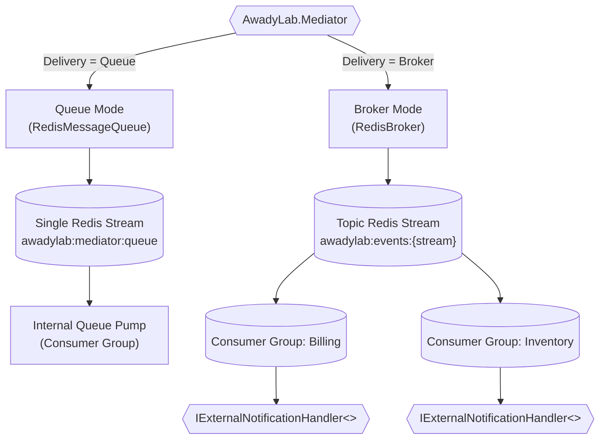

# AwadyLab.Mediator.Redis

Redis Streams queue and distributed pub/sub broker transport for [AwadyLab.Mediator](https://www.nuget.org/packages/AwadyLab.Mediator).

[](https://www.nuget.org/packages/AwadyLab.Mediator.Redis)


---

## Overview

`AwadyLab.Mediator.Redis` brings robust message streaming and distributed pub/sub to `AwadyLab.Mediator` powered by **Redis Streams** and **Consumer Groups**:



### Why Redis Streams?

Unlike Redis `PUBLISH`/`SUBSCRIBE` (which drops messages if a subscriber is offline and does not support acknowledgments), **Redis Streams** provides:
* **Durable At-Least-Once Delivery**: Messages are persisted in the stream until explicitly acknowledged (`XACK`).
* **Consumer Groups**: Independent microservices or service instances can form consumer groups (`XREADGROUP`), load-balancing or competing for messages safely.
* **Pending Entries & Auto-Claim**: If a worker process crashes mid-execution, unacknowledged entries exceeding `ClaimIdleTimeout` are automatically claimed and retried by surviving workers (`XAUTOCLAIM`).

---

## Features & Reliability

* **Caller-Owned Connection Lifecycle**: The multiplexer is provided via `ConnectionMultiplexerFactory`, seamlessly integrating with existing Redis configurations and never forcibly closing caller connections.
* **Automatic Stream Trimming**: Streams are capped using approximate trimming (`MAXLEN ~ MaxStreamLength`), ensuring predictable Redis memory usage with minimal CPU overhead.
* **Auto-Claim Crashed Workers**: Unacknowledged messages exceeding `ClaimIdleTimeout` are automatically reclaimed and delivered to active workers, preventing message loss when pods or instances crash.
* **Auto-Reconnection**: Re-establishes stream subscriptions automatically if Redis disconnects or fails over.
* **Dead-Letter Routing**: Envelopes that exhaust retries are routed to the configured `DeadLetterStream` or local `IDeadLetterSink`.

---

## Installation

```bash
dotnet add package AwadyLab.Mediator.Redis
```

---

## Quickstart

### 1. Register in DI (`Program.cs`)

```csharp
using AwadyLab.Mediator;
using AwadyLab.Mediator.Redis;
using AwadyLab.Mediator.Redis.Options;
using StackExchange.Redis;

var builder = WebApplication.CreateBuilder(args);

// Register existing ConnectionMultiplexer in DI (or supply factory directly)
builder.Services.AddSingleton<IConnectionMultiplexer>(sp =>
    ConnectionMultiplexer.Connect("localhost:6379"));

builder.Services.AddMediator([typeof(Program).Assembly], options =>
{
    options.UseRedis(new RedisOptions
    {
        // Reuses existing IConnectionMultiplexer or creates a new connection
        ConnectionMultiplexerFactory = () => Task.FromResult(
            builder.Services.BuildServiceProvider().GetRequiredService<IConnectionMultiplexer>()),

        // 1. Enable Broker Pub/Sub Mode
        Broker = new RedisBrokerOptions
        {
            StreamPrefix = "myapp:events",
            Prefetch = 15,
            MaxStreamLength = 50_000
        },

        // 2. (Optional) Enable Durable Queue Mode for local queue delivery
        Queue = new RedisQueueOptions
        {
            StreamKey = "myapp:mediator:queue",
            Prefetch = 10
        }
    });
});

var app = builder.Build();
```

---

## Broker Mode (Cross-Service Pub/Sub)

Broadcasts events across microservices using Redis Streams. Subscribing services bind their consumer groups to the stream.

### 1. Define Notification & Stream Topology

Implement `IExternalNotificationDefinition<T>` to declare the target stream:

```csharp
using AwadyLab.Mediator.Abstraction;
using AwadyLab.Mediator.Abstraction.Messaging;
using AwadyLab.Mediator.Models.Options;
using AwadyLab.Mediator.Redis;

// Domain event contract
public record OrderPlacedNotification(Guid OrderId, decimal Total) : INotification;

// Topology definition (stream mapping)
public sealed class OrderPlacedDefinition : IExternalNotificationDefinition<OrderPlacedNotification>
{
    public void Define(ExternalNotificationOptions options)
    {
        // Resulting Redis stream key will be '{StreamPrefix}:orders.placed'
        options.Redis.Stream = "orders.placed";
        options.Redis.MaxStreamLength = 100_000; // Optional per-stream retention limit
    }
}
```

### 2. Implement External Subscriber Handler

Consumers implement `IExternalNotificationHandler<T>` and specify a static `QueueName` (which serves as the **Consumer Group** name):

```csharp
using AwadyLab.Mediator.Abstraction.Messaging;
using AwadyLab.Mediator.Models.Options;

[ExternalSubscription(Prefetch = 20, MaxRetries = 3)]
public class BillingServiceHandler(IBillingService billing) 
    : IExternalNotificationHandler<OrderPlacedNotification>
{
    // Required: Acts as the Redis Consumer Group on the stream
    public static string QueueName => "billing-service";

    public async Task Handle(OrderPlacedNotification notification, CancellationToken ct)
    {
        await billing.GenerateInvoiceAsync(notification.OrderId, notification.Total, ct);
    }
}
```

### 3. Publishing to the Broker

```csharp
await mediator.Publish(new OrderPlacedNotification(orderId, 250m), options =>
{
    options.Delivery = NotificationDelivery.Broker;

    // Optional: extra headers carried with this stream entry (Redis Streams don't route on headers —
    // this is metadata a consumer can read, not a filter, since every consumer group sees every entry).
    options.Redis.Headers["region"] = "eu";
});
```

---

## Queue Mode (Durable In-Process Channel)

When `RedisOptions.Queue` is configured, `NotificationDelivery.Queue` routes envelopes through a durable Redis Stream instead of an in-memory channel:

```csharp
await mediator.Publish(new OrderPlacedNotification(orderId, 250m), options =>
{
    options.Delivery = NotificationDelivery.Queue;
});
```

* Survives service restarts.
* Drained by the mediator's background `NotificationQueuePump` workers with consumer group coordination.

---

## Options Reference

### `RedisOptions`

| Option | Type | Default | Description |
| :--- | :--- | :--- | :--- |
| `ConnectionMultiplexerFactory` | `Func<Task<IConnectionMultiplexer>>` | *(Required)* | Async factory supplying the `IConnectionMultiplexer`. |
| `PollInterval` | `TimeSpan` | `250ms` | Polling frequency when no new stream messages are pending. |
| `ClaimIdleTimeout` | `TimeSpan` | `30s` | Duration before an unacknowledged message can be auto-claimed from another worker. |
| `Broker` | `RedisBrokerOptions?` | `null` | Enables cross-service pub/sub broker mode when configured. |
| `Queue` | `RedisQueueOptions?` | `null` | Enables durable stream queue mode for `NotificationDelivery.Queue`. |

### `RedisBrokerOptions`

| Option | Type | Default | Description |
| :--- | :--- | :--- | :--- |
| `StreamPrefix` | `string` | `"awadylab:events"` | Prefix prepended to all topic streams (`{StreamPrefix}:{stream}`). |
| `MaxStreamLength` | `int` | `100_000` | Global approximate retention limit for broker streams. |
| `Prefetch` | `int` | `10` | Default prefetch count for consumer group reads (`COUNT`). |
| `StartPosition` | `RedisStreamStartPosition` | `NewMessages` | Where consumer groups start (`NewMessages` or `Beginning`). |
| `DeadLetterStream` | `string?` | `null` | Optional dead-letter stream key for exhausted broker messages. |

### `RedisQueueOptions`

| Option | Type | Default | Description |
| :--- | :--- | :--- | :--- |
| `StreamKey` | `string` | `"awadylab:mediator:queue"` | Redis Stream key used for local queue delivery. |
| `ConsumerGroup` | `string` | `"mediator-pump"` | Consumer group name used by queue pump workers. |
| `MaxStreamLength` | `int` | `100_000` | Stream retention cap for the queue stream. |
| `Prefetch` | `int` | `10` | Consumer prefetch count for queue pump workers. |
| `DeadLetterStream` | `string?` | `null` | Optional stream key for exhausted envelopes. |

---

## License

Package by Mohamed Elawady
```
Copyright (c) Mohamed Elawady. All rights reserved.

This software is closed source and proprietary. Subject to the terms below,
you are granted a free, worldwide, non-exclusive license to:

  - Use this software, in source or compiled (NuGet package) form, in your
    own applications, including commercial applications, at no charge.

You may NOT:

  - Redistribute, sublicense, sell, or publish this software (or any
    modified version of it) as a standalone product, library, or package,
    including republishing it under a different name on NuGet.org or any
    other package repository.
  - Reverse engineer, decompile, or disassemble the compiled package except
    to the extent applicable law expressly permits this despite this
    limitation.
  - Remove or alter any copyright, trademark, or other proprietary notices.

THE SOFTWARE IS PROVIDED "AS IS", WITHOUT WARRANTY OF ANY KIND, EXPRESS OR
IMPLIED, INCLUDING BUT NOT LIMITED TO THE WARRANTIES OF MERCHANTABILITY,
FITNESS FOR A PARTICULAR PURPOSE AND NONINFRINGEMENT. IN NO EVENT SHALL THE
AUTHOR BE LIABLE FOR ANY CLAIM, DAMAGES OR OTHER LIABILITY, WHETHER IN AN
ACTION OF CONTRACT, TORT OR OTHERWISE, ARISING FROM, OUT OF OR IN CONNECTION
WITH THE SOFTWARE OR THE USE OR OTHER DEALINGS IN THE SOFTWARE.
```
